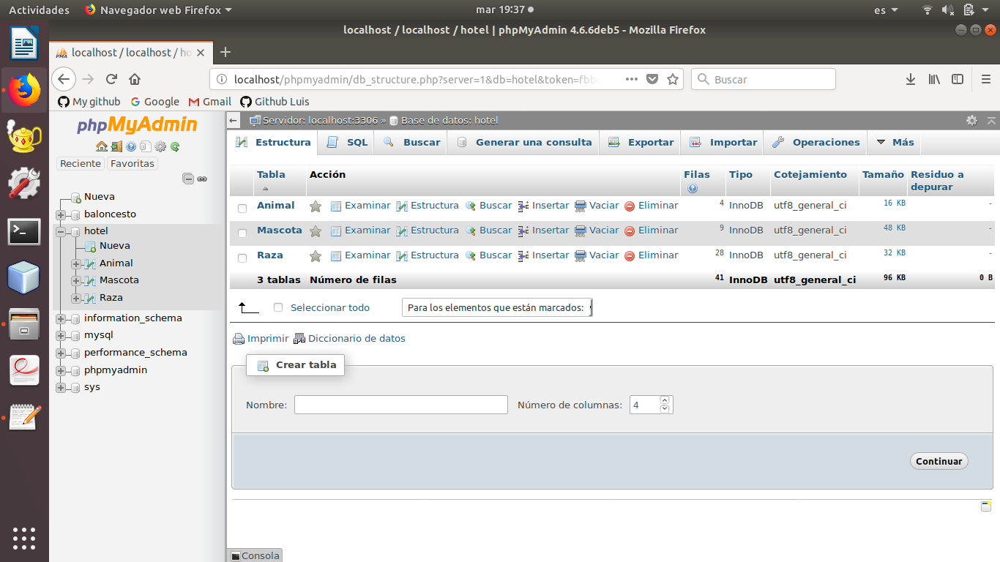

# Ejercicio-CRUD
Práctia altas, bajas, modificaciones y listado.
* Se llevara acabo con jsp y base de datos mysql.

Yo para mi práctica he elegido un Hotel de Mascotas donde das de alta los animales que entran nuevos en el hotel y le asignas una habitación, también puedes borrarlo una vez se ha ido o modificar algo dato que haya sido introducido mal en el alta del cliente.

# Base datos MySQL
En la base de datos he creado tres tablas relacionales Mascota, Animal y Raza con sus respectivas claves foráneas.
* Mascota: se guardan los datos de los animales que son dados de alta en el hotel.
* Animal: guarda los tipos de animales que se admiten en el hotel.
* Raza: almacena las razas de los animales que podemos dar de alta.

