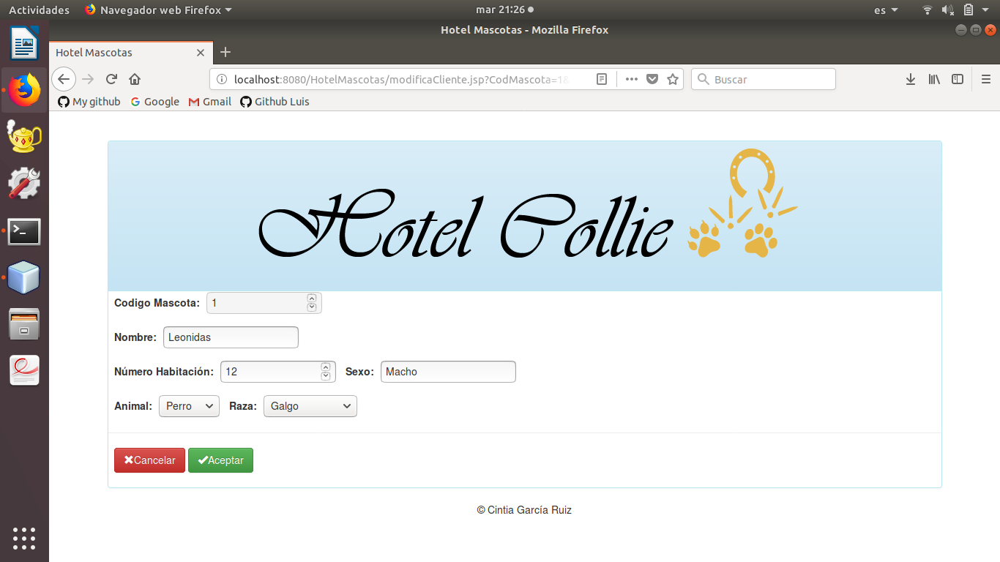

# Ejercicio-CRUD
Práctia altas, bajas, modificaciones y listado.
* Se llevara acabo con jsp y base de datos mysql.

Para mi práctica he elegido un Hotel de Mascotas donde das de alta los animales que entran nuevos en el hotel y le asignas una habitación, también puedes borrarlo una vez se ha ido o modificar algun dato que haya sido introducido mal en el alta del cliente.

# Base datos MySQL
En la base de datos he creado tres tablas relacionales Mascota, Animal y Raza con sus respectivas claves foráneas.

 * Animal: guarda los tipos de animales que se admiten en el hotel.

 * Mascota: se guardan los datos de los animales que son dados de alta en el hotel.

 * Raza: almacena las razas de los animales que podemos dar de alta.

# Ejercicio JSP

 * En la página de inicio nos muestra un listado de los animales dados de alta, y a su vez las demás funcionalidades, como dar de alta un nuevo cliente.

 * Una vez has dado de alta aparece un mensaje en el que te dice que se ha grabado satisfactóriamente.

 * Si le das al botón de modificar te pasa a otra página donde te aparecen los datos del cliente que has seleccionado para modificarlos.

 * Una vez le das aceptar los cambios de la modificación te muestra un mensaje el cual te indica que se ha grabado bien y aparece un botón para volver a la página de inicio.

